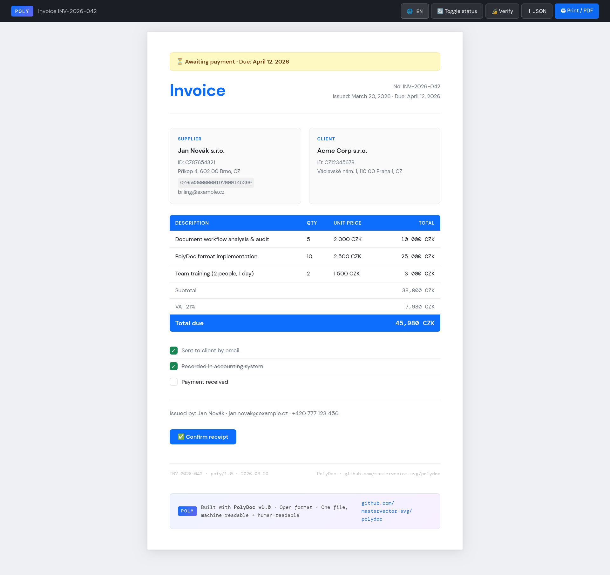

# PolyDoc

[](LICENSE)
[](spec/POLYDOC_SPEC.md)
[]()
[]()

**One file. Machine-readable data. Human-readable document. Works everywhere.**

```html
<!-- This HTML file IS the document, the data, and the API. -->
<script type="application/poly+json" id="raw-data">
{
  "header": { "format": "poly/1.0", "doc_id": "INV-2026-001", "doc_type": "invoice" },
  "content": { "sections": [ ... ] }
}
</script>
```

Open it in a browser → you see a beautiful document.
Feed it to an LLM → it reads the JSON directly.
Send it as email → static version passes every firewall.
Click the button → full interactive version loads on your server.

**MIT. Free. No SDK. No account. No bullshit.**

---

## Live Demo

[](https://mastervector-svg.github.io/polydoc/examples/invoice-demo.html)

*Click the image → interactive document opens. Toggle 🌐 for language switch. Toggle 🤖 to see what the LLM reads.*

| Document | Link |
|----------|------|
| **Invoice demo (EN/CS, Human/Agent view)** | [invoice-demo.html](https://mastervector-svg.github.io/polydoc/examples/invoice-demo.html) |
| Invoice — full interactive | [faktura-full.html](https://mastervector-svg.github.io/polydoc/examples/faktura-full.html) |
| Invoice — static mail version | [faktura-mail.html](https://mastervector-svg.github.io/polydoc/examples/faktura-mail.html) |
| Real estate portal — transfer package | [realportal-transfer.html](https://mastervector-svg.github.io/polydoc/examples/realportal-transfer.html) |
| **Envelope demo** — invoice package (cover letter + JSON + terms) | [envelope-demo.html](https://mastervector-svg.github.io/polydoc/examples/envelope-demo.html) |
| **IoT: Interactive config** — config file = admin panel, zero backend | [interactive-config.html](https://mastervector-svg.github.io/polydoc/examples/interactive-config.html) |
| **IoT: Firewall config** — schema versioning, signature, POST to device | [iot-firewall-config.html](https://mastervector-svg.github.io/polydoc/examples/iot-firewall-config.html) |
| **IoT: Sensor telemetry** — log file that renders itself as a dashboard | [iot-sensor-telemetry.html](https://mastervector-svg.github.io/polydoc/examples/iot-sensor-telemetry.html) |
| **IoT: Device passport** — identity, API spec, warranty, manufacturer signature | [device-passport.html](https://mastervector-svg.github.io/polydoc/examples/device-passport.html) |

---

## The Problem

You're in 2026. AI runs half your workflow. And you're still emailing PDF attachments.

| Format | Problem | Price |
|--------|---------|-------|
| **PDF** | Static, machine-unreadable, OCR to read it back | Adobe: $20/mo |
| **DOCX** | Binary XML, requires Microsoft ecosystem | M365: $13/user/mo |
| **DocuSign / PandaDoc** | Portal login, vendor lock-in, API costs | $25–$65/mo |
| **Plain JSON** | Can't be opened directly, needs a viewer | — |
| **PolyDoc** | ✅ One HTML file, works everywhere, AI-native | **$0. MIT. Forever.** |

Every tool forces you to choose between **human-readable** and **machine-readable**. PolyDoc refuses that tradeoff.

---

## The Solution

A single `.html` file that is simultaneously:

- ✅ **A document** — open in any browser, print to PDF, looks professional
- ✅ **A database** — structured JSON inside, parseable by any tool or LLM
- ✅ **An API response** — AI agents render and deliver via Channel API
- ✅ **An email** — static mail version passes every spam filter and firewall
- ✅ **A transfer container** — ship entire project configs, agent setups, knowledge bases
- ✅ **A cryptographic envelope** — wrap any files, sign the manifest, encrypt parts independently, send as one HTML file

---

## Six Use Cases

### 1. Transactional Documents
Invoices, confirmations, offers, contracts.

```
IS/Backend → generates PolyDoc → sends as email body (static)
                                → stores on server (interactive)
User clicks → full version loads → confirm, download, verify signature
```

### 2. AI Channel (DisplayPort for AI)
AI agents use the [Channel API](spec/openapi.yaml) to render and deliver documents. One OpenAPI spec — any LLM understands it immediately. No prompt engineering. The spec is the instruction.

```
User: "Send Novák an invoice for consulting"
Claude: reads Channel API → assembles JSON → POST /render → shares html_url
```

### 3. Transfer Format
Move entire projects between tools (Lovable → Cursor → your IS). Agent configs, knowledge bases, frontend structures — all in one signed, versioned, optionally compressed file.

```
Lovable export → polydoc-transfer.html → Cursor import
                                       → open in browser to inspect
                                       → feed to Claude as context
```

### 4. Envelope — Universal Cryptographic Container

This is the one people don't see coming.

A PolyDoc Envelope is a **single `.html` file** that can contain **literally anything**:

```
📄 INSTALL.md              text/markdown        ← human reads this in browser
🤖 agent-config.json       application/json     ← AI agent reads this
🐳 docker-compose.yml      text/plain           ← ops team deploys this
📦 compiler-linux.tar.gz   application/x-tar    ← downloads and installs
📑 license.pdf             application/pdf      ← legal signs this
📎 nested.html             application/polydoc  ← another PolyDoc inside
```

Open it in a browser → you see the manifest: what's inside, how big, who signed it.
Click a part → it opens inline (markdown rendered, JSON highlighted, image shown).
Binary files → download button. The envelope never changes, only what you open.

**The manifest is always readable — without a key, without an account, without anything.**
You can verify the sender's signature and confirm receipt before opening a single file.

```
Sender signs manifest (hash of each part) → sends .html by email
Recipient opens browser                   → sees manifest, verifies signature
Recipient opens only what they need       → encrypted parts need the key
AI agent reads manifest                   → decides what to fetch and process
```

Multi-recipient: Alice gets parts 1 and 3. Bob gets all parts. Neither knows the other exists. Server only sees SHA256 key hints — never identities.

This is what secure email should have been. Except it's a plain HTML file.

[→ Live demo](https://mastervector-svg.github.io/polydoc/examples/envelope-demo.html) · [→ Spec](spec/POLYDOC_ENVELOPE.md)

### 5. Live Commerce Document

This is the one that replaces EDI.

A PolyDoc Envelope can embed a **portal config** (credentials, API key) as an encrypted part, then pull **live listings** from that portal as an on-demand fill slot — current prices, current stock, current availability. The recipient opens a single HTML file and sees real data, not a screenshot from last Tuesday.

```
Supplier builds envelope:
  🔑 portal-config.json    encrypted    ← API key / login, never leaves server
  📦 listings              on-demand    ← fetched live from portal API (cache: 1h)
  ✅ order                 slot         ← buyer fills this → sends back

Buyer opens in browser → sees live listings → clicks order → done.
Or: AI agent opens it → reads listings JSON → places order without browser.
```

**Why this matters:**

| EDI (1990s) | PolyDoc Commerce |
|-------------|-----------------|
| Proprietary VAN network | Plain HTML file, any email |
| $50k integration project | One `POST /envelope` call |
| Separate viewer software | Any browser, zero install |
| Static snapshot | Live data via Fill Providers |
| No audit trail | Manifest signature: buyer saw *exactly this version* |

**Both directions work:**

- **Buy side:** Receive an envelope from a supplier → live stock + prices → order slot → sign and return
- **Sell side:** Generate an envelope with your catalog → send to 100 buyers → each sees their negotiated price (different encrypted config per recipient, multi-recipient envelope)

The manifest signature guarantees that the listings the buyer saw at order time are the listings the supplier sent. "Price changed after you clicked" stops being possible.

```json
"parts": [
  { "id": "config",   "type": "application/json", "encrypted": true,
    "fill": { "mode": "manual" } },

  { "id": "listings", "type": "application/json",  "slot": true,
    "fill": { "mode": "on-demand",
              "src": "https://portal.example.com/api/search?q=cnc-router",
              "auth": "api_key", "auth_from_part": "config",
              "cache_ttl": 3600 } },

  { "id": "order",    "type": "application/x-polydoc-action", "slot": true,
    "fill": { "mode": "manual", "review_required": true } }
]
```

`auth_from_part: "config"` — the server reads credentials from the encrypted part and uses them for the provider call. Credentials never appear in the HTML.

[→ Fill Providers spec](spec/POLYDOC_ENVELOPE.md#11-fill-providers--on-demand-slot-filling-by-external-service)

### 6. IoT & Embedded Devices — the killer use case

> *"I used to ship 8 MB of React to configure a smart socket. Now I ship one HTML file."*

Every IoT device has the same dirty secret: the hardware is simple, but the configuration UI is a nightmare. You need a backend, a frontend framework, CORS headers, a build pipeline, and a cloud account — just so a technician can change a threshold value on a €40 sensor.

PolyDoc collapses that entire stack into a single file.

#### How it works

The device stores **one file** in flash memory. When you connect, it serves it.
Your phone's browser opens it and renders a full admin panel — no app, no account, no cloud.
You change the values, click Save, and the browser POSTs the **same file** back to the device with your changes baked in. The device reads the JSON block, applies it, restarts.

```
ESP32 flash          Your browser              Back to device
─────────────        ──────────────────        ──────────────
config.html    →     renders admin panel  →    POST /config
               ←     edit values          ←
               ←     "Save" = mutated     →    device reads
                     same HTML file            config+json block
```

The device-side handler is ~50 lines of MicroPython:

```python
from html.parser import HTMLParser
import json

class ConfigExtractor(HTMLParser):
    def __init__(self):
        super().__init__()
        self.in_cfg = False
        self.data = ""
    def handle_starttag(self, tag, attrs):
        if tag == "script" and dict(attrs).get("type") == "application/config+json":
            self.in_cfg = True
    def handle_endtag(self, tag):
        if tag == "script": self.in_cfg = False
    def handle_data(self, data):
        if self.in_cfg: self.data += data

def apply_config(html_body):
    p = ConfigExtractor()
    p.feed(html_body)
    cfg = json.loads(p.data)
    verify_signature(cfg)   # reject tampered configs
    check_schema_version(cfg)  # reject incompatible configs
    apply(cfg)              # write to NVS / restart services
```

That's it. No HTTP framework. No REST API design. No JSON schema debate.
The entire admin panel — UI, data, documentation, validation logic — is in the HTML file.

#### What's solved automatically

**Version compatibility** — every config file carries `schema_version` and `firmware_min`.
The device checks both before applying anything. Incompatible config = rejected, not silently broken.

**Tamper detection** — the manufacturer signs the config block (SHA256-RSA).
A modified file fails verification before any value is applied.
"Who changed the pressure threshold and when?" — it's in the audit trail inside the file.

**Encryption for zero-trust deployment** — encrypt the config block with
`AES-256-GCM(config, HMAC(device_secret, device_id))`.
The file is readable only by the device it was generated for.
You can email it, put it in a public repo, or store it in an S3 bucket — without a VPN.

**Air-gapped maintenance** — technician downloads `status.html` from the device via USB or Bluetooth.
Opens it on a tablet (no app, just Chrome). Sees live telemetry rendered as an interactive dashboard.
Edits config, signs with their own key, uploads back.
The audit trail now says: *"Pressure threshold changed by Karel Novák, 2026-03-22 11:30"*.

**Self-rendering logs** — instead of sending a CSV or raw JSON, the device generates a PolyDoc telemetry file.
Open it in a browser → you see a Grafana-style dashboard with anomaly markers, event timeline, and export buttons.
No Grafana. No InfluxDB. No server. The log carries its own visualization.

**Device Passport** — shipped in the box (or served from the device). One HTML file containing:
identity, hardware specs, full API documentation, certifications with expiry dates, warranty terms,
firmware changelog, and manufacturer signature. Your AI assistant reads it and knows exactly
what the device is and how to talk to it — without scraping, without OCR, without a portal login.

#### The numbers

| Traditional IoT admin UI | PolyDoc |
|--------------------------|---------|
| React frontend (~8 MB) + Node backend + CORS + build pipeline | 1 HTML file (~50 KB) |
| Separate config file (`config.json`) + viewer app | Config IS the viewer |
| "What firmware does this device need?" → check docs portal | Read `firmware_min` from the file |
| Verify device authenticity → call manufacturer API | Verify signature locally, offline |
| Read device logs → install Grafana + InfluxDB | Open the log file in a browser |
| Update config → SSH + edit JSON + restart | Edit in browser + click Save |

#### Examples

| File | What it shows |
|------|--------------|
| [interactive-config.html](examples/interactive-config.html) | Config file = admin panel. Edit values, download updated file. Zero backend. |
| [iot-firewall-config.html](examples/iot-firewall-config.html) | Firewall/router config: schema versioning, signature, POST to device, air-gapped download. |
| [iot-sensor-telemetry.html](examples/iot-sensor-telemetry.html) | Sensor log that renders itself as a dashboard. Anomalies flagged in the data, highlighted in charts. |
| [device-passport.html](examples/device-passport.html) | Digital birth certificate: identity, API spec, certs, warranty countdown, manufacturer signature. |

Open any of them in a browser. Then open the source. The file is the data. The data is the file.

---

## Why `.html`?

- **Zero installation** — every device has a browser
- **Passes every firewall** — it's just an HTML file
- **AI-native** — LLMs read HTML source, find the JSON, done
- **Self-describing** — the spec URL is inside every document
- **Print-ready** — CSS print styles built in

We could invent `.poly` or `.pdoc`. We didn't. Because the best format is the one that works everywhere, right now, without asking IT for permission.

---

## Dual-Mode Architecture

Every PolyDoc exists in two versions generated from the same JSON:

```
[Your IS / Backend]
        ↓ same JSON data
        ├── mail version    → static HTML, zero JS, into email body
        │                     < 50 KB, passes every client
        │                     one CTA button → link to full version
        │
        └── full version    → complete JS interpreter
                              live status from API
                              interactive buttons
                              signature verification
                              hosted on your server or downloadable
```

**The firewall bypass strategy:**
Mail is static → passes every corporate filter.
User wants interactivity → clicks to full version.
User asks IT to whitelist your domain.
IT cannot say no because the user is asking.

---

## Format at a Glance

```json
{
  "header": {
    "format": "poly/1.0",
    "spec": "https://github.com/mastervector-svg/polydoc/blob/master/spec/POLYDOC_SPEC.md",
    "doc_id": "INV-2026-001",
    "doc_type": "invoice",
    "signature": { "algorithm": "ES256", "value": "..." },
    "compression": { "algorithm": "deflate-raw", "threshold": 10240 }
  },
  "metadata": {
    "title": { "en": "Invoice", "cs": "Faktura" },
    "language": "en",
    "languages": ["en", "cs"]
  },
  "content": {
    "type": "document",
    "sections": [
      { "type": "party", "role": "supplier", "data": { "name": "..." } },
      { "type": "table", "columns": [...], "rows": [...], "footer": {...} }
    ]
  },
  "visuals": { "theme": "modern-clean", "colors": { "primary": "#0d6efd" } },
  "logic": {
    "conditions": [{ "field": "is_paid", "value": true, "banner": { "text": "✅ PAID" } }],
    "actions": [{ "label": "Confirm order", "api_url": "..." }]
  }
}
```

Validate against [`schema/poly-v1.0.schema.json`](schema/poly-v1.0.schema.json).

---

## Repository Structure

```
polydoc/
│
├── README.md                    ← you are here
├── CONTRIBUTING.md              ← how to contribute
├── CHANGELOG.md                 ← version history
│
├── spec/
│   ├── POLYDOC_SPEC.md          ← format specification v1.0
│   ├── POLYDOC_TRANSFER.md      ← transfer format specification
│   ├── POLYDOC_ENVELOPE.md      ← envelope format specification (incl. §11 Fill Providers)
│   ├── POLYDOC_WORKFLOW.md      ← workflow, DRM, time-lock, quorum, Git integration
│   ├── DEPLOYMENT_REALTY.md     ← deployment guide: real estate portal (EN)
│   ├── DEPLOYMENT_REALTY.cs.md  ← deployment guide: real estate portal (CS)
│   ├── openapi.yaml             ← Channel API (OpenAPI 3.1, EN)
│   └── openapi.cs.yaml          ← Channel API (OpenAPI 3.1, CS — preserved)
│
├── schema/
│   └── poly-v1.0.schema.json    ← JSON Schema validator (IDE autocomplete)
│
├── server/                      ← Node.js render engine (Express)
│   ├── index.js                 ← POST /render, POST /validate, GET /schema
│   └── engine.js                ← renderFull, renderMail, DEFLATE compression
│
├── templates/
│   ├── polydoc-full.html        ← full interactive template
│   ├── polydoc-mail.html        ← static mail template
│   ├── polydoc-transfer.html    ← transfer viewer template
│   └── polydoc-envelope.html    ← envelope viewer template (extracted from buildEnvelopeHtml())
│
├── examples/
│   ├── invoice-demo.html        ← bilingual EN/CS demo + Human/Agent toggle
│   ├── faktura-full.html        ← invoice example (full)
│   ├── faktura-mail.html        ← invoice example (mail)
│   └── realportal-transfer.html ← real estate project transfer
│
├── docs/
│   ├── PITCH.md                 ← why PolyDoc exists
│   ├── ARCHITECTURE.md          ← deep dive into design decisions
│   ├── AI_INTEGRATION.md        ← how AI agents use PolyDoc
│   └── SECURITY.md              ← signing, encryption, auth
│
└── tools/
    └── README.md                ← planned: CLI, validators, importers
```

---

## Quickstart

**Open the demo:**
```bash
git clone https://github.com/mastervector-svg/polydoc.git
cd polydoc
open examples/invoice-demo.html   # macOS
xdg-open examples/invoice-demo.html  # Linux
```

**Use the template:**
1. Copy `templates/polydoc-full.html`
2. Replace the JSON in `<script type="application/poly+json" id="raw-data">`
3. Open in browser — done

**Run with Docker (easiest):**
```bash
docker run -p 3000:3000 ghcr.io/mastervector-svg/polydoc:latest
# POST /render with PolyDoc JSON → get html_url + mail_html
```

**Or with docker-compose:**
```bash
docker compose up
```

**Run locally (Node.js):**
```bash
cd server && npm install && npm start
```

**Backend integration (PHP):**
```php
$template = file_get_contents('templates/polydoc-full.html');
$json = json_encode($yourData, JSON_PRETTY_PRINT | JSON_UNESCAPED_UNICODE);
$html = preg_replace(
    '/<script type="application\/poly\+json" id="raw-data">[\s\S]*?<\/script>/',
    "<script type=\"application/poly+json\" id=\"raw-data\">\n{$json}\n</script>",
    $template
);
```

**AI agent fills envelope slots:**
```bash
# 1. Pack envelope with slots + natural language instructions
POST /envelope
{
  "manifest": { "parts": [{
    "id": "compose", "type": "text/yaml", "slot": true,
    "fill_prompt": "docker-compose for Node.js + PostgreSQL 16 + Redis"
  }]}
}

# 2. LLM generates content, returns draft for review
POST /envelope/ENV-xxx/fill-ai
{ "slot_id": "compose", "auto_fill": false }
→ { "status": "draft", "draft": "version: '3.8'\nservices: ..." }

# 3. Apply (or auto_fill: true to skip review)
POST /envelope/ENV-xxx/fill
{ "slot_id": "compose", "data": "..." }
```

```bash
# Configure your LLM (OpenAI-compatible, any model)
LLM_BASE_URL=https://your-llm/v1
LLM_API_KEY=your-key
LLM_MODEL=qwen2.5-coder:32b
docker run -p 3000:3000 -e LLM_BASE_URL -e LLM_API_KEY -e LLM_MODEL \
  ghcr.io/mastervector-svg/polydoc:latest
```

---

## Roadmap

### v1.0
- [x] Core format spec (header, metadata, content, visuals, logic)
- [x] Multilingual support (`LocalizedString` — `{"en":"...","cs":"..."}`)
- [x] Section types: header, party, table, image, rich_text, checklist
- [x] Full interpreter (inline, single-file, zero dependencies)
- [x] Mail template (static, no JS, Outlook-compatible)
- [x] Transfer format spec
- [x] Channel API (OpenAPI 3.1)
- [x] JSON Schema (`schema/poly-v1.0.schema.json`)
- [x] Node.js render engine (POST /render, POST /validate)
- [x] deflate-raw compression (RFC 1951, cross-browser + MicroPython compatible) + AES-256-GCM encryption spec
- [x] Lazy load spec (inline / on-demand modes)
- [x] Human/Agent view toggle (demo)

### v1.1 ✅
- [x] Envelope format (`doc_type: "envelope"`) — any file, any MIME type, one HTML
- [x] Envelope Slots — collaborative filling, `fill_prompt`, `workspace://`
- [x] `POST /envelope/:id/fill` — fill slot via API
- [x] `POST /envelope/:id/fill-ai` — **LLM agent fills slot** (OpenAI-compatible, any model)
- [x] VS Code extension scaffold — sidebar, fill, pack, preview, scheduled fill
- [x] Shared interpreter on CDN (`poly-interpreter.js`)
- [x] SubtleCrypto signature verification (browser)
- [x] `npx polydoc render invoice.json` CLI
- [x] DOMPurify integration for `rich_text`
- [x] More themes (dark, classic, minimal)
- [x] VS Code extension — publish to Marketplace

### v1.2 (current)
- [x] Fill Providers — on-demand slot filling by external service (spec §11)
- [x] POLYDOC_WORKFLOW.md — DRM, time-lock, quorum, Git integration
- [x] RFC 3161 trusted timestamp in signatures
- [x] Four-eyes principle + remote notary (eIDAS qualified)
- [x] Embedded media & WASM apps inside envelope
- [x] Export lock with per-user watermark
- [x] Full English translation of all spec files
- [ ] Shared interpreter on CDN (`poly-interpreter.js`)
- [ ] SubtleCrypto signature verification (browser)
- [ ] `npx polydoc render invoice.json` CLI
- [ ] DOMPurify integration for `rich_text`
- [ ] More themes (dark, classic, minimal)
- [ ] VS Code extension — publish to Marketplace
- [ ] `POST /envelope/:id/fill-provider` server implementation

### v2.0
- [ ] MCP server — PolyDoc as MCP tool for AI agents (`fill_slot`, `pack_envelope`, `list_envelopes`)
- [ ] WYSIWYG editor
- [ ] Official integrations (Lovable, Cursor, n8n)
- [ ] Offline-first (Service Worker)
- [ ] Key server reference implementation
- [ ] Notary service reference implementation

---

## License

**MIT. Everything. Forever.**

Format spec, templates, interpreter, render engine, JSON Schema, examples — all MIT.
Build on it. Ship it. Sell it. Don't ask.

No "community edition". No "enterprise tier". No usage limits.
If you need PDF generation, DocuSign, or PandaDoc — you're paying for something PolyDoc does for free.

---

## Support & Hire Us

PolyDoc is free. If it saves you money or time:

☕ **Buy us a coffee** — [ko-fi.com](https://ko-fi.com) *(link coming soon)*

🚀 **Hire us for a real project** — We design systems like this for a living.
Automation, AI document workflows, IS integrations, custom PolyDoc deployments.
If you can imagine it and it makes business sense, we can build it.

> *"This is what we come up with for fun. Imagine what we do when you pay us."*

📬 Open an issue or start a discussion — we read everything.

---

## Contributing

See [CONTRIBUTING.md](CONTRIBUTING.md).
Issues, PRs, and spec proposals welcome.

The spec lives in `spec/POLYDOC_SPEC.md`. If you use PolyDoc in production, open an issue — we want to know.

---

*PolyDoc v1.0 · [Spec](spec/POLYDOC_SPEC.md) · [Channel API](spec/openapi.yaml) · [JSON Schema](schema/poly-v1.0.schema.json) · MIT*
